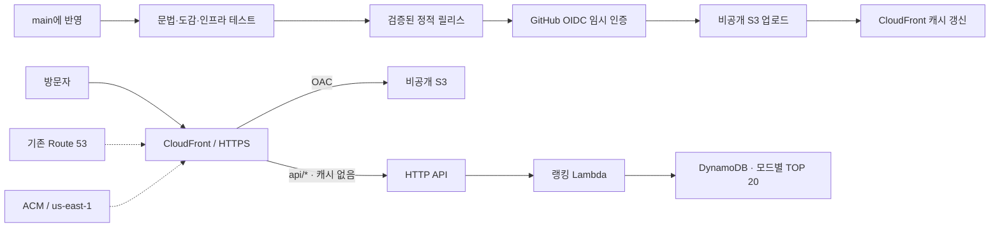

# 포켓몬 플레이 AWS와 CI/CD

구성일: 2026-10-02, 공유 랭킹 추가: 2026-10-07. 참고: 공유 `../docs/aws-deployment-guide.md`의 podcast 구성. 게임 파일은 S3·CloudFront·ACM·기존 Route 53 영역으로 제공하고, 공유 랭킹은 HTTP API·Lambda·DynamoDB로 저장합니다. GitHub Actions로 웹과 랭킹 서버 코드를 자동 배포하고, 인프라 변경은 CDK diff 검토 후 별도로 배포합니다.

초기 구성 시 AWS 계정과 기존 리소스를 조회하여 대상 도메인·인증서·CloudFront·GitHub OIDC Provider가 없는 것을 확인했습니다. 기존 서울 CDK bootstrap과 pir.kr 공개 호스팅 영역을 재사용합니다. 최초 인프라 배포 후 GitHub 자동 배포를 활성화합니다.

## 구성

| 항목 | 설정 |
|---|---|
| GitHub | `himinseop/pokemon`, 기본 브랜치 `main` |
| AWS 계정 / 리전 | `733625312722` / `ap-northeast-2` |
| 로컬 SSO 프로필 | podcast와 같은 `podbbangcast` 사용 가능 |
| 스택 | `PokemonPlayProd`, 종료 보호 |
| 주소 | `https://pokemon.pir.kr` |
| 기존 Route 53 영역 | `pir.kr` / `Z25C4QNYU409X8` |
| ACM | `us-east-1`, 기존 인증서 참조 또는 DNS 자동 검증 |
| 배포 환경 | GitHub `production`, `main`만 배포 가능하도록 설정 |
| 배포 IAM Role | `pokemon-play-prod-github-deploy` |

AWS 계정과 Route 53 영역은 제공된 podcast 문서에서 가져온 값입니다. 처음 배포하기 전에 아래 identity 확인으로 계정 일치를 확인합니다. 이 스택은 별도의 웹 버킷과 CloudFront 배포를 만들며 podcast 리소스를 수정하지 않습니다. 기존 `pokemon.pir.kr`용 수동 AWS 배포가 있으면 새 스택을 바로 생성하지 말고 기존 배포/인증서/DNS 연결을 먼저 확인합니다.



`infra/config.json`에 배포 설정을 모았습니다. CDK는 서울 스택에서 인증서용 보조 리소스를 통해 us-east-1 인증서를 만드는 podcast와 같은 패턴을 사용합니다. 인증서 ARN을 지정하면 기존 인증서를 참조합니다. S3는 공개 접근·ACL 차단, SSL 강제, AWS 관리형 암호화, `RETAIN`입니다. CloudFront는 OAC, HTTPS 리디렉션, 정적 파일 GET/HEAD, 압축, `PRICE_CLASS_200`, 표준 보안 헤더를 사용합니다. `api/*` 경로만 캐시 없이 HTTP API로 전달합니다. 공유 랭킹은 DynamoDB on-demand, Python 3.13 ARM64 Lambda(256MB, 동시 실행 5개), HTTP API(초당 10개/순간 20개 요청 제한)로 구성하며 로그는 7일 보존합니다. 새 호스팅 영역·EC2·NAT·RDS·SQS는 추가하지 않습니다. 자세한 저장 방식은 [공유 랭킹](shared-rankings.md)을 참고합니다.

CloudFront 정액 Free 플랜을 자동 선택하는 코드가 아닙니다. podcast와 같은 종량제 CloudFront 구성이며 S3 저장·요청·전송, CloudFront 요청·전송·무효화 및 CDK 보조 리소스는 사용량에 따른 비용이 있습니다. 기존 계정의 무료 범위와 다른 서비스 사용량을 함께 확인합니다.

## 최초 설정

### 1. 설치와 AWS 로그인

저장소 루트(`pokemon-play`)에서 실행합니다. Node.js 22.13 이상, Python 3.10 이상, AWS CLI v2, GitHub CLI가 필요합니다.

```sh
npm ci
npm run ci
aws sso login --profile podbbangcast
aws sts get-caller-identity --profile podbbangcast
```

계정이 `733625312722`인지 확인합니다. 최초 구성에서는 SSO 로그인 갱신 후 이 계정과 기존 리소스를 확인했습니다.

### 2. 계정의 기존 GitHub OIDC Provider 확인

OIDC Provider는 계정 전체에서 공유합니다. 이미 있으면 중복 생성하지 않도록 `infra/config.json`의 `githubOidcProviderArn`에 반환된 GitHub ARN을 넣습니다. 없으면 빈 문자열을 유지하여 CDK로 생성합니다.

```sh
aws iam list-open-id-connect-providers --profile podbbangcast --output json
```

GitHub Provider의 ARN 형식:

```text
arn:aws:iam::733625312722:oidc-provider/token.actions.githubusercontent.com
```

Trust policy는 `himinseop/pokemon` 저장소의 `production` 환경과 `sts.amazonaws.com` audience만 허용합니다. 확인한 고유 ID는 소유자 `1148821`, 저장소 `1400912995`입니다. 2026-07-15 이후 생성된 저장소의 고유 ID subject와 기존 이름 subject를 모두 정확히 지정하며 wildcard로 다른 저장소를 허용하지 않습니다. [GitHub OIDC subject 규칙](https://docs.github.com/en/actions/how-tos/secure-your-work/security-harden-deployments/oidc-in-aws).

### 3. CDK 최초 배포

이 계정·서울 리전이 podcast 배포를 위해 이미 bootstrap되었다면 다시 bootstrap하지 않아도 됩니다. 준비되지 않은 환경만 한 번 실행합니다.

```sh
npx cdk bootstrap aws://733625312722/ap-northeast-2 --profile podbbangcast
```

```sh
npm run aws:synth
npm run aws:diff -- --profile podbbangcast
npm run aws:deploy -- --profile podbbangcast
```

diff에서 기존 리소스가 의도치 않게 교체되지 않는지와 추가 DB·API·IAM 권한을 검토합니다. 인증서의 DNS 검증과 CloudFront 준비에는 시간이 걸립니다. `aws:deploy`는 인프라만 배포하며 게임 파일은 아직 업로드하지 않습니다. 반환된 `SiteUrl`, `WebBucketName`, `DistributionId`, `GitHubDeployRoleArn`, `RankingsTableName`, `RankingFunctionName`, `RankingApiUrl`은 `exports/aws-outputs.json`에도 저장됩니다. `pir.kr`의 공개 DNS가 해당 Route 53 영역에 연결되어 있어야 자동 검증·A/AAAA Alias가 작동합니다.

### 4. GitHub 환경과 변수

GitHub Settings → Environments에서 **production**을 만들고 **Deployment branches and tags → Selected branches and tags → Branch: main**으로 제한합니다. 승인 대기 없이 자동 배포하려면 required reviewers는 지정하지 않습니다. 환경 제한은 IAM trust policy의 environment subject와 함께 사용합니다. 아래 API로도 동일하게 설정할 수 있습니다.

```sh
gh api --method PUT repos/himinseop/pokemon/environments/production \
  --input - <<'JSON'
{"deployment_branch_policy":{"protected_branches":false,"custom_branch_policies":true}}
JSON
gh api --method POST repos/himinseop/pokemon/environments/production/deployment-branch-policies \
  -f name=main -f type=branch
```

저장소의 Actions **Variables**에 아래 두 값을 설정합니다. AWS access key/secret은 저장하지 않습니다.

```sh
gh variable set AWS_ROLE_ARN --repo himinseop/pokemon \
  --body arn:aws:iam::733625312722:role/pokemon-play-prod-github-deploy
# AWS 최초 배포가 성공한 뒤에만 활성화
gh variable set AWS_DEPLOY_ENABLED --repo himinseop/pokemon --body true
gh workflow run aws.yml --repo himinseop/pokemon --ref main
```

AWS 준비 전에는 `AWS_DEPLOY_ENABLED`를 설정하지 않거나 `false`로 둡니다. 이 상태에서도 CI 검사는 실행되고 AWS 배포 job만 건너뜁니다. 처음 활성화할 때 Role이 신뢰하는 production 환경의 main 제한이 설정됐는지 확인합니다.

## 배포 동작

- PR과 main push: JS 문법, 1,025종/모습/지방 그룹과 이미지 누락, CDK 권한·OAC·DNS·캐시 설정, 빌드·업로드 순서 테스트를 실행합니다. PR은 AWS 인증 없이 검증만 합니다.
- 빌드: 로컬 `dist`는 유지하고 `dist-aws`를 생성합니다. 이미지·아이콘과 앱/스타일 파일명을 SHA-256 기반 경로로 바꾸고 JSON/CSS/HTML 참조도 함께 변경합니다. 원본 수집을 CI에서 다시 실행하지 않습니다.
- 랭킹 서버 빌드: `exports/ranking-function.zip`과 별도 manifest를 생성합니다. 서버 소스는 공개 S3에 올리지 않습니다.
- 무결성: 릴리스 manifest에 모든 파일의 SHA-256을 기록합니다. 업로드 전 빠진 파일·추가 파일·변경된 파일을 검사하고, AWS 계정과 스택의 도메인도 확인합니다. 웹과 Lambda artifact의 revision과 체크섬이 일치해야 게시합니다.
- 배포: 검증 job의 같은 릴리스 artifact를 production job에서 사용합니다. 다른 빌드 결과를 새로 만들지 않습니다. production 배포는 동시에 하나씩 실행하고, 진행 중인 업로드를 새 commit으로 강제 취소하지 않습니다.
- 업로드: 검증된 랭킹 Lambda 코드를 먼저 갱신하고 완료를 기다립니다. 해시 이미지에는 1년 immutable 캐시를 적용하고 `--size-only`로 동일 이미지의 반복 업로드를 피합니다. 변경된 내용은 새 파일명을 갖습니다. 다른 파일은 `no-cache`, HTML은 `no-cache,no-store,must-revalidate`로 업로드합니다. HTML을 마지막에 올린 뒤 CloudFront `/*` 한 경로를 무효화하고 완료를 기다립니다.
- 이전 이미지/앱 파일을 자동 삭제하지 않습니다. 따라서 이전 캐시 화면의 해시 경로도 유지됩니다. 장기적으로 불필요해진 파일을 정리할 때는 실제 참조와 복구 계획을 별도로 확인합니다.
- 마지막으로 공개 초대장·관리자 화면과 API 설정을 확인합니다. 초대 제한이 켜져 있으면 인증 없는 게임·도감 데이터 접근은 403, 랭킹 API는 401/403이어야 합니다. GitHub Actions 결과와 릴리스 commit SHA가 배포 이력입니다.

배포 Role에는 지정 버킷의 List/Get/Put, 지정 CloudFront의 Create/GetInvalidation, 이 스택의 DescribeStacks와 지정 랭킹 Lambda의 UpdateFunctionCode/GetFunctionConfiguration만 부여합니다. S3 삭제, CDK/CloudFormation 변경, IAM 관리나 다른 프로젝트 배포 권한은 없습니다. AWS 리소스 자체를 바꿀 때는 로컬 SSO로 diff/deploy 절차를 수행합니다.

## 수동 게시와 복구

최초 인프라를 만든 뒤 GitHub를 활성화하기 전에도 게시할 수 있습니다.

```sh
npm run check
npm test
npm run aws:build:web
npm run aws:build:ranking
npm run aws:publish -- --profile podbbangcast
```

`main`의 문제 commit을 revert하여 반영하면 CI가 복구 릴리스를 배포합니다. 수동 복구는 정상 commit의 코드에서 검증·빌드·게시 절차를 다시 실행합니다. 인프라 변경·DNS 변경은 이 파일 게시만으로 되돌아가지 않습니다. 새로 등록한 랭킹은 공유 DynamoDB에 저장합니다. 기존 브라우저의 개인 기록은 삭제하거나 자동 공개하지 않으며, 공유 기록으로 자동 이전되지 않습니다. 스택 삭제 시에도 랭킹 테이블은 보존합니다.

AWS 작업 없이 로컬 게임만 실행할 때는 기존처럼 `dist`를 제공합니다. 단순 정적 서버에는 `/api`가 없으므로 공유 랭킹은 운영 사이트에서 확인합니다.

```sh
npm start
```


## 초대 접속과 관리자 페이지 최초 적용

공유 주소는 `https://pokemin.pir.kr/<43자 난수 키>`이고, 공유 주소를 열면 같은 경로의 `pokemon.pir.kr`로 먼저 이동합니다. 서로 다른 도메인의 localStorage를 공유할 수 없으므로 발급과 저장은 메인 도메인에서 합니다. `shareDomainName`을 비우면 공유 주소도 `pokemon.pir.kr`를 사용합니다. 초대 링크는 3일 뒤 만료되며 기존에 받은 기기 키는 자동 만료되지 않습니다. 여기서 기기는 브라우저의 저장 공간 단위입니다.

`/admin`은 공개 로그인 화면이고 실제 초대·기기·접속 기록 API는 Cognito access token, PKCE 로그인, `admins` 그룹으로 제한합니다. 일반 회원가입은 열지 않습니다. 접속 기기의 이름, 첫·최근 접속 시간, 접속 횟수, 브라우저 정보와 방문 기록을 별도 `pokemon-play-prod-access` DynamoDB에 보존합니다. 차단·삭제된 키는 다음 메인 접속 또는 검증에서 브라우저 저장 공간에서 삭제하며 서명 쿠키도 만료시킵니다. 일시적인 통신 실패에는 키를 지우지 않습니다.

관리 화면은 초대 링크와 접속 관리 페이지 탭으로 나누며, 접속 관리 안에서 기기/기록을 전환합니다. 로그인 화면에는 헤더 없이 피카츄를 표시합니다. 접속 기록의 이름 옆 뱃지는 디바이스 ID 앞 8자리이며 전체 ID는 뱃지의 설명에 포함합니다. 인증에 사용하는 디바이스 키의 비밀 부분은 관리자에게 노출하지 않습니다. 초대 링크 삭제는 관리자 인증 후 실제 DynamoDB 항목을 영구 삭제하며, 이미 발급된 디바이스 키나 랭킹은 삭제하지 않습니다.

접속 기록은 이름이 있는 기기의 메인 진입과 새로고침, 트레이너 이름 입력 완료의 validate/profile 요청에서 생성합니다. 이름 입력 전에는 기록을 만들지 않으며 문제 전환과 8시간 세션 갱신만으로는 생성하지 않습니다. 같은 기기는 마지막 기록 생성 후 30분 안에 추가 기록을 만들지 않고 최근 접속 시간·이름·브라우저 정보만 갱신합니다. 서버 트랜잭션의 `lastVisitAt` 조건으로 동시 요청도 중복 기록을 방지합니다. 30분 경계에서 다음 진입에 새 기록이 생깁니다. 기존 접속 기록은 보존합니다.

운영 설정의 `invitationAccessEnabled`는 최종적으로 true여야 합니다. 새 인프라를 기존 사이트에 추가할 때는 아래 순서로 적용합니다. 초기 배포에서 바로 제한을 켜지 않아 관리자와 서명 설정을 끝낼 수 있도록 합니다.

```sh
# 1. 현재 랭킹 내용을 읽기 전용으로 백업하고 새 인프라를 추가합니다.
aws sso login --profile podbbangcast
npx cdk diff --profile podbbangcast -c invitationAccessEnabled=false
npx cdk deploy PokemonPlayProd --profile podbbangcast -c invitationAccessEnabled=false --outputs-file exports/aws-outputs.json

# 2. SSM 서명 키와 관리자 계정을 준비합니다. 이메일은 운영자 주소를 지정합니다.
python3 scripts/provision-access.py --profile podbbangcast --email ADMIN_EMAIL

# 3. 검증한 웹·서버 파일을 게시합니다.
npm run ci
npm run aws:publish -- --profile podbbangcast

# 4. 관리자 로그인과 초대 링크 발급·접속을 먼저 확인한 뒤 접근 제한을 켭니다.
npx cdk diff --profile podbbangcast
npm run aws:deploy -- --profile podbbangcast
python3 scripts/verify-published.py
```

서명은 RSA 2048 / SHA-256을 사용합니다. 공개 키만 `infra/cloudfront-public.pem`으로 버전 관리합니다. 최초 생성한 개인 키 `exports/cloudfront-private.pem`은 권한 0600으로 보관하고 Git·웹 배포에서 제외합니다. 설정 스크립트는 이를 SSM Standard SecureString에 저장하며 기존 키가 다른 경우 덮어쓰지 않습니다. 이미 운영 중인 키는 새로 생성하지 않습니다. 기기 키 원문은 브라우저에 저장하고 DB에는 SHA-256 검증 해시만 저장합니다. 관리자 목록에도 기기 키 원문을 전달하지 않습니다.

관리자 계정 생성 이메일은 보내지 않으며 최초 로그인 정보는 권한 0600의 `exports/admin-credentials.txt`에만 기록합니다. 이미 로그인 가능한 계정은 비밀번호를 변경하지 않습니다. 생성 중 실패한 계정은 스크립트를 다시 실행하여 마무리할 수 있습니다. 관리자에게 메일을 보내는 비밀번호 찾기는 Cognito 로그인 화면에서 직접 요청할 수 있습니다.

CloudFront 서명 쿠키와 초대 확인 창은 8시간입니다. 확인 성공 시 기기 키에 묶인 확인 시간을 localStorage에 기록하며, 8시간 안의 재접속에서는 설정·확인 API를 기다리지 않고 보호된 게임 파일을 바로 가져옵니다. 접속 로그는 기존 profile API의 recordVisit으로 백그라운드에서 기록하며 쿠키나 확인 시간을 연장하지 않습니다. 쿠키가 삭제·만료되어 파일 접근이 거절되면 확인 시간을 버리고 다시 검증합니다. 활성 페이지는 8시간 경계에 다시 확인하고 일시적인 통신 오류는 키를 유지한 채 재시도합니다. 만료되는 것은 파일 접근 세션이고 영구 기기 키는 유지합니다. 이미지·게임 HTML·JS·CSS·JSON·파비콘은 trusted key group으로 보호하고, 공개 초대장 파일과 관리자 로그인 화면만 예외입니다. 공개 경로는 viewer function에서도 허용 목록으로 제한해 인코딩된 우회 경로가 게임 파일로 전달되지 않게 합니다. API 요청은 캐시하지 않고 Authorization·기기 키 헤더와 쿠키를 전달합니다. 관리자 차단은 다음 접속/API 검증에서 반영되며 이미 발급된 파일 접근 쿠키는 다음 검증 또는 8시간 만료까지 유효합니다. 재접속의 백그라운드 로그·랭킹 요청도 기기 상태를 확인하므로 차단이 확인되면 클라이언트 키와 확인 기록을 삭제합니다.

기존 랭킹 테이블의 이름·키 구조·보존 정책은 변경하지 않습니다. 인프라 diff에서 랭킹 테이블 교체·삭제가 보이면 배포를 멈추고 확인합니다. GitHub 자동 배포 권한은 계속 파일과 Lambda 코드 갱신만 허용하며 초대·랭킹 DB 삭제 권한을 주지 않습니다. 최초 적용 이후 일반 배포가 기기나 초대·랭킹 기록을 초기화하지 않습니다.

로컬에서는 `npm start`로 게임만 미리 볼 수 있습니다. 관리자와 초대 API는 AWS에서 동작합니다. `npm test`는 만료·기존 키 재사용·차단·삭제·접속 로그·관리자 권한·쿠키 서명·브라우저 진입과 기존 게임을 검증합니다. CI는 실제 boto3 SDK의 트랜잭션 직렬화도 확인합니다.

메시지 초대 링크 미리보기는 공개 index.html의 Open Graph 제목·이미지 메타데이터와 `/public/party-preview.png`를 사용합니다. 이미지 URL에 내용 해시를 버전 쿼리로 붙여 교체된 썸네일을 구분합니다. 이미지는 1733×907 포켓몬 파티 포스터 PNG이며 CloudFront 공개 경로 허용 목록에 그 파일만 추가합니다. 공유 해시 경로도 같은 공개 HTML을 반환하고 공유 도메인의 HTTP 리다이렉트는 해시 경로를 유지합니다. 미리보기 요청은 초대장 검증이나 디바이스 발급 없이 처리되며 게임 파일과 API 인증은 그대로 적용됩니다.

관리자에서 접속 기기 행의 접속 기록 버튼은 `/api/admin/visits?deviceId=<ID>`로 조회합니다. ID는 32자리 소문자 16진수로 검증하고 Cognito 관리자 인증이 필요합니다. 기존 byKind 인덱스에서 기기 필터를 적용하며 새 DB/인덱스는 만들지 않습니다. 필터로 비어 있는 인덱스 페이지는 한 요청에서 최대 5개까지 넘겨 찾고, 이후 페이지가 남으면 다음 커서를 돌려줍니다. 기기 필터를 해제하면 전체 기록으로 돌아갑니다.
