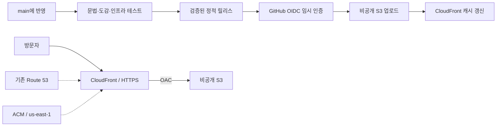

# 포켓몬 플레이 AWS와 CI/CD

구성일: 2026-10-02. 참고: 공유 `../docs/aws-deployment-guide.md`의 podcast 구성. 게임은 정적 사이트이므로 S3·CloudFront·ACM·기존 Route 53 영역만 사용합니다. GitHub Actions로 정적 릴리스를 자동 배포하고, 인프라 변경은 CDK diff 검토 후 별도로 배포합니다.

초기 구성 시 AWS 계정과 기존 리소스를 조회하여 대상 도메인·인증서·CloudFront·GitHub OIDC Provider가 없는 것을 확인했습니다. 기존 서울 CDK bootstrap과 pir.kr 공개 호스팅 영역을 재사용합니다. 최초 인프라 배포 후 GitHub 자동 배포를 활성화합니다.

## 구성

| 항목 | 설정 |
|---|---|
| GitHub | `himinseop/pokemon`, 기본 브랜치 `main` |
| AWS 계정 / 리전 | `733625312722` / `ap-northeast-2` |
| 로컬 SSO 프로필 | podcast와 같은 `podbbangcast` 사용 가능 |
| 스택 | `PokemonPlayProd`, 종료 보호 |
| 주소 | `https://pokemon.pir.kr` |
| 기존 Route 53 영역 | `pir.kr` / `Z25C4QNYU409X8` |
| ACM | `us-east-1`, 기존 인증서 참조 또는 DNS 자동 검증 |
| 배포 환경 | GitHub `production`, `main`만 배포 가능하도록 설정 |
| 배포 IAM Role | `pokemon-play-prod-github-deploy` |

AWS 계정과 Route 53 영역은 제공된 podcast 문서에서 가져온 값입니다. 처음 배포하기 전에 아래 identity 확인으로 계정 일치를 확인합니다. 이 스택은 별도의 웹 버킷과 CloudFront 배포를 만들며 podcast 리소스를 수정하지 않습니다. 기존 `pokemon.pir.kr`용 수동 AWS 배포가 있으면 새 스택을 바로 생성하지 말고 기존 배포/인증서/DNS 연결을 먼저 확인합니다.



`infra/config.json`에 배포 설정을 모았습니다. CDK는 서울 스택에서 인증서용 보조 리소스를 통해 us-east-1 인증서를 만드는 podcast와 같은 패턴을 사용합니다. 인증서 ARN을 지정하면 기존 인증서를 참조합니다. S3는 공개 접근·ACL 차단, SSL 강제, AWS 관리형 암호화, `RETAIN`입니다. CloudFront는 OAC, HTTPS 리디렉션, GET/HEAD, 압축, `PRICE_CLASS_200`, 표준 보안 헤더를 사용합니다. 새 호스팅 영역·EC2·NAT·업무 Lambda·DynamoDB·SQS·유료 로그를 추가하지 않습니다. ACM/OIDC 생성용 CDK 보조 리소스는 업무 서버와 별개입니다.

CloudFront 정액 Free 플랜을 자동 선택하는 코드가 아닙니다. podcast와 같은 종량제 CloudFront 구성이며 S3 저장·요청·전송, CloudFront 요청·전송·무효화 및 CDK 보조 리소스는 사용량에 따른 비용이 있습니다. 기존 계정의 무료 범위와 다른 서비스 사용량을 함께 확인합니다.

## 최초 설정

### 1. 설치와 AWS 로그인

저장소 루트(`pokemon-play`)에서 실행합니다. Node.js 22.13 이상, Python 3.10 이상, AWS CLI v2, GitHub CLI가 필요합니다.

```sh
npm ci
npm run ci
aws sso login --profile podbbangcast
aws sts get-caller-identity --profile podbbangcast
```

계정이 `733625312722`인지 확인합니다. 최초 구성에서는 SSO 로그인 갱신 후 이 계정과 기존 리소스를 확인했습니다.

### 2. 계정의 기존 GitHub OIDC Provider 확인

OIDC Provider는 계정 전체에서 공유합니다. 이미 있으면 중복 생성하지 않도록 `infra/config.json`의 `githubOidcProviderArn`에 반환된 GitHub ARN을 넣습니다. 없으면 빈 문자열을 유지하여 CDK로 생성합니다.

```sh
aws iam list-open-id-connect-providers --profile podbbangcast --output json
```

GitHub Provider의 ARN 형식:

```text
arn:aws:iam::733625312722:oidc-provider/token.actions.githubusercontent.com
```

Trust policy는 `himinseop/pokemon` 저장소의 `production` 환경과 `sts.amazonaws.com` audience만 허용합니다. 확인한 고유 ID는 소유자 `1148821`, 저장소 `1400912995`입니다. 2026-07-15 이후 생성된 저장소의 고유 ID subject와 기존 이름 subject를 모두 정확히 지정하며 wildcard로 다른 저장소를 허용하지 않습니다. [GitHub OIDC subject 규칙](https://docs.github.com/en/actions/how-tos/secure-your-work/security-harden-deployments/oidc-in-aws).

### 3. CDK 최초 배포

이 계정·서울 리전이 podcast 배포를 위해 이미 bootstrap되었다면 다시 bootstrap하지 않아도 됩니다. 준비되지 않은 환경만 한 번 실행합니다.

```sh
npx cdk bootstrap aws://733625312722/ap-northeast-2 --profile podbbangcast
```

```sh
npm run aws:synth
npm run aws:diff -- --profile podbbangcast
npm run aws:deploy -- --profile podbbangcast
```

diff에서 새 버킷·CloudFront·DNS·IAM 구성인지 검토합니다. 인증서의 DNS 검증과 CloudFront 준비에는 시간이 걸립니다. `aws:deploy`는 인프라만 배포하며 게임 파일은 아직 업로드하지 않습니다. 반환된 `SiteUrl`, `WebBucketName`, `DistributionId`, `GitHubDeployRoleArn`은 `exports/aws-outputs.json`에도 저장됩니다. `pir.kr`의 공개 DNS가 해당 Route 53 영역에 연결되어 있어야 자동 검증·A/AAAA Alias가 작동합니다.

### 4. GitHub 환경과 변수

GitHub Settings → Environments에서 **production**을 만들고 **Deployment branches and tags → Selected branches and tags → Branch: main**으로 제한합니다. 승인 대기 없이 자동 배포하려면 required reviewers는 지정하지 않습니다. 환경 제한은 IAM trust policy의 environment subject와 함께 사용합니다. 아래 API로도 동일하게 설정할 수 있습니다.

```sh
gh api --method PUT repos/himinseop/pokemon/environments/production \
  --input - <<'JSON'
{"deployment_branch_policy":{"protected_branches":false,"custom_branch_policies":true}}
JSON
gh api --method POST repos/himinseop/pokemon/environments/production/deployment-branch-policies \
  -f name=main -f type=branch
```

저장소의 Actions **Variables**에 아래 두 값을 설정합니다. AWS access key/secret은 저장하지 않습니다.

```sh
gh variable set AWS_ROLE_ARN --repo himinseop/pokemon \
  --body arn:aws:iam::733625312722:role/pokemon-play-prod-github-deploy
# AWS 최초 배포가 성공한 뒤에만 활성화
gh variable set AWS_DEPLOY_ENABLED --repo himinseop/pokemon --body true
gh workflow run aws.yml --repo himinseop/pokemon --ref main
```

AWS 준비 전에는 `AWS_DEPLOY_ENABLED`를 설정하지 않거나 `false`로 둡니다. 이 상태에서도 CI 검사는 실행되고 AWS 배포 job만 건너뜁니다. 처음 활성화할 때 Role이 신뢰하는 production 환경의 main 제한이 설정됐는지 확인합니다.

## 배포 동작

- PR과 main push: JS 문법, 1,025종/모습/지방 그룹과 이미지 누락, CDK 권한·OAC·DNS·캐시 설정, 빌드·업로드 순서 테스트를 실행합니다. PR은 AWS 인증 없이 검증만 합니다.
- 빌드: 로컬 `dist`는 유지하고 `dist-aws`를 생성합니다. 이미지·아이콘과 앱/스타일 파일명을 SHA-256 기반 경로로 바꾸고 JSON/CSS/HTML 참조도 함께 변경합니다. 원본 수집을 CI에서 다시 실행하지 않습니다.
- 무결성: 릴리스 manifest에 모든 파일의 SHA-256을 기록합니다. 업로드 전 빠진 파일·추가 파일·변경된 파일을 검사하고, AWS 계정과 스택의 도메인도 확인합니다.
- 배포: 검증 job의 같은 릴리스 artifact를 production job에서 사용합니다. 다른 빌드 결과를 새로 만들지 않습니다. production 배포는 동시에 하나씩 실행하고, 진행 중인 업로드를 새 commit으로 강제 취소하지 않습니다.
- 업로드: 해시 이미지에는 1년 immutable 캐시를 적용하고 `--size-only`로 동일 이미지의 반복 업로드를 피합니다. 변경된 내용은 새 파일명을 갖습니다. 다른 파일은 `no-cache`, HTML은 `no-cache,no-store,must-revalidate`로 업로드합니다. HTML을 마지막에 올린 뒤 CloudFront `/*` 한 경로를 무효화하고 완료를 기다립니다.
- 이전 이미지/앱 파일을 자동 삭제하지 않습니다. 따라서 이전 캐시 화면의 해시 경로도 유지됩니다. 장기적으로 불필요해진 파일을 정리할 때는 실제 참조와 복구 계획을 별도로 확인합니다.
- 마지막으로 HTTPS 화면과 1,025종 manifest를 확인합니다. GitHub Actions 결과와 릴리스 commit SHA가 배포 이력입니다.

배포 Role에는 지정 버킷의 List/Get/Put, 지정 CloudFront의 Create/GetInvalidation, 이 스택의 DescribeStacks만 부여합니다. S3 삭제, CDK/CloudFormation 변경, IAM 관리나 다른 프로젝트 배포 권한은 없습니다. AWS 리소스 자체를 바꿀 때는 로컬 SSO로 diff/deploy 절차를 수행합니다.

## 수동 게시와 복구

최초 인프라를 만든 뒤 GitHub를 활성화하기 전에도 게시할 수 있습니다.

```sh
npm run check
npm test
npm run aws:build:web
npm run aws:publish -- --profile podbbangcast
```

`main`의 문제 commit을 revert하여 반영하면 CI가 복구 릴리스를 배포합니다. 수동 복구는 정상 commit의 코드에서 검증·빌드·게시 절차를 다시 실행합니다. 인프라 변경·DNS 변경은 이 파일 게시만으로 되돌아가지 않습니다. 랭킹은 기존과 같이 브라우저 localStorage이며 도메인이 바뀌면 기존 Sites 주소의 기록이 자동 이전되지 않습니다.

AWS 작업 없이 로컬 게임만 실행할 때는 기존처럼 `dist`를 제공합니다.

```sh
npm start
```
